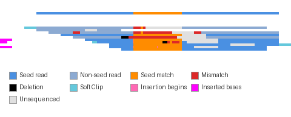
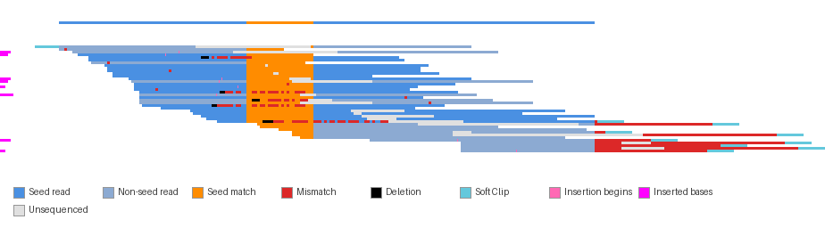
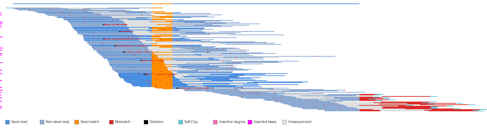

# Pileup Visualization

Visualizes how paired-end reads align to an assembled contig, highlighting a seed sequence of interest.



<details>
<summary>More examples</summary>

**40 reads:**


**150 reads:**


</details>

## Requirements

```bash
uv sync --extra pileup  # Installs Pillow and pysam for pileup visualization
```

## Inputs

| Argument | Description |
|----------|-------------|
| `--fwd-fastq` | Forward reads (R1) FASTQ file |
| `--rev-fastq` | Reverse reads (R2) FASTQ file |
| `--contigs-fasta` | Assembled contigs FASTA file |
| `--contig-name` | Name of the contig to visualize |
| `--seed-sequence` | DNA sequence to highlight (e.g., the assembly seed) |
| `--output` | Output PNG path |

## Usage

```bash
python -m outward_assembly.pileup \
    --fwd-fastq reads_R1.fastq \
    --rev-fastq reads_R2.fastq \
    --contigs-fasta contigs.fasta \
    --contig-name "contig_1" \
    --seed-sequence "ATCGATCGATCG" \
    --output output.png
```

## Optional Arguments

| Argument | Default | Description |
|----------|---------|-------------|
| `--scale-x` | 2 | Horizontal pixel scale factor |
| `--scale-y` | 2 | Vertical pixel scale factor |
| `--padding` | 10 | Padding around image elements (pixels) |
| `--contig-height` | 10 | Height of contig ribbon (pixels) |
| `--threads` | 4 | Threads for bowtie2 alignment |

## Output

A PNG image showing:
- **Top ribbon**: The contig sequence (blue = non-seed, orange = seed region)
- **Stacked rows**: Each row is one read pair, sorted by alignment position
- **Left/right sidebars**: Magenta markers indicating insertions

### Color Legend

| Color | Meaning |
|-------|---------|
| Blue | Matching bases (read pair contains entire seed) |
| Muted blue | Matching bases (read pair does not contain entire seed) |
| Orange | Matching bases within the seed region |
| Red | Mismatched bases |
| Black | Deletions (bases in contig but not in read) |
| Cyan | Soft-clipped bases |
| Pink line | Insertion marker (inline) |
| Magenta | Insertion count (edge sidebars) |
| Light grey | Unsequenced insert (gap between mates) |

### Insertion and Deletion Semantics

The **contig** is the reference sequence. Each column in the visualization corresponds to one contig position.

- **Deletion**: Bases present in the contig but absent from the read. These are shown as black pixels inline, since they occupy contig positions.

- **Insertion**: Bases present in the read but absent from the contig. Since there's no contig column for these bases, insertions can't be shown inline at full resolution.

**How insertions are displayed:**

| Location | Appearance | Meaning |
|----------|------------|---------|
| **Inline** | Thin pink vertical line at right edge of base | Marks the position *after which* an insertion occurred. The base color is preserved; the pink line indicates "an insertion starts here." The size of the insertion is not shown. |
| **Edge sidebars** | Solid magenta pixels | The left/right margins show the *total count* of inserted bases for the upstream/downstream mate. |

## Python API

```python
from outward_assembly.pileup import create_pileup_visualization

image = create_pileup_visualization(
    fwd_fastq="reads_R1.fastq",
    rev_fastq="reads_R2.fastq",
    contigs_fasta="contigs.fasta",
    contig_name="contig_1",
    seed_sequence="ATCGATCGATCG",
    output_path="output.png",  # Optional: saves to file
    scale=(2, 2),
    padding=10,
    contig_height=10,
    threads=4
)
# Returns: numpy array of shape (height, width, 4) with RGBA values
```

