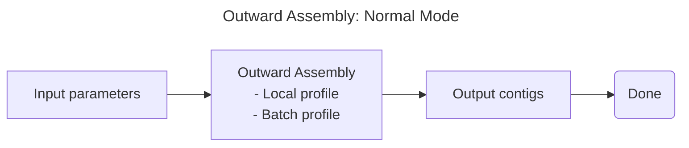
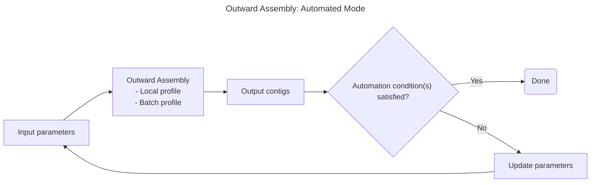

# Usage

There are two profiles for outward assembly:
* *Local*: Run outward assembly using your local machine.
* *Batch*: Run outward assembly using AWS Batch through Nextflow

There are two types of outward assembly modes:
* *Normal*: Run outward assembly once
* *Automated*: Run outward assembly multiple times, in a loop.

Below we will cover when and how to use the different modes and profiles. Here is a diagram to help visualize the different modes and profiles:





Table of Contents:
1. [Overview](#overview)
2. [Profiles](#profiles)
   - [Local profile](#local-profile)
   - [Batch profile](#batch-profile)
3. [Modes](#modes)
   - [Normal Mode](#normal-mode)
   - [Automated Mode](#automated-mode)
4. [Working directory structure](#working-directory-structure)
5. [Tips](#tips)

## Overview

The primary entrypoint to outward assembly is the Python function `outward_assembly` in `outward_assembly/pipeline.py`; a command line interface does not (yet) exist. See the docstring of `outward_assembly` for a detailed description of keyword parameters. The required parameters are:
* The path to a seed sequence (fasta) to assemble outward from;
* A list of s3 paths of reads to assemble. Reads must be in [SIZ format](./algorithm_details.md#input-data);
* Path for output contigs.

Using the `outward_assembly` function as described above would be considered running outward assembly in *normal* mode, whereas our *automated* mode builds abstractions on top of this function to allow for more complex workflows. Specifically, *automated* mode automates the labor-intensive iterative process of:

1. Running outward assembly;
2. Evaluating outputs;
3. Deciding whether to accept the outputs as final or modify parameters and re-run.

Outward assembly generates lots of intermediate results in its working directory; these are especially useful if you want to monitor the progress of an assembly in progress, retrieve results from intermediate iterations, or debug a crash. See the `outward_assembly` arguments `work_dir_parent` and `cleanup`.

## Profiles

### Local profile
The local profile utilizes the resources on your current machine.

#### Why use local profile?
Best suited for situations with a small number of reads.

#### Usage
Set `use_batch = false` in the outward_assembly parameters to trigger the local profile.

### Batch profile
The batch profile allows scaling to large numbers of reads by utilizing AWS Batch jobs.

#### Why use batch profile?
Ideal for scenarios where large datasets (potentially tens to hundreds of billions of reads) need processing, which is impractical on a single machine.

*For most users, we recommend using the local profile and just scaling up the number of compute resources that you're using (e.g. pick an EC2 instance with more cores and memory). We recommend that you do this and only use the batch profile if you find that the local profile is too slow.*

#### Usage
Call `outward_assembly` with `use_batch = true`, making sure to pass values for `batch_workdir`, `batch_queue`, and `tower_token`.

## Modes

### Normal Mode
*Normal* mode is designed for users who want to run the outward assembly algorithm once. This would include a user who knows that specific samples contain reads that would assemble with their seed sequence. 

#### Usage

The usage of the *normal* mode in outward assembly requires that the user call the outward assembly function with the appropriate parameters. The only setup that the user needs to do is to generate a list of s3 paths to their reads.

We've provided the function `s3_files_with_prefix` in `io_helpers.py` to assist you in generating a list of s3 paths. E.g. to get paths to split files from three demux sets:

```python
prefixes = [
	"outward-assembly-test-data/siz/simulated-abcbd-reads_1",
	"outward-assembly-test-data/siz/simulated-abcbd-reads_2",
]
paths = [p for prefix in prefixes for p in s3_files_with_prefix("nao-testing", prefix)]
```

where `outward-assembly-test-data/siz/simulated-abcbd-reads_1` would correspond to all reads with that specific prefix for the first demux set, for example:

```
s3://nao-testing/outward-assembly-test-data/siz/simulated-abcbd-reads_1_div0001.fastq.zst
s3://nao-testing/outward-assembly-test-data/siz/simulated-abcbd-reads_1_div0002.fastq.zst
s3://nao-testing/outward-assembly-test-data/siz/simulated-abcbd-reads_1_div0003.fastq.zst
```

### Automated mode

*Automated* mode is designed for users who need to run outward assembly iteratively. This would include a user who is unsure which samples contain reads that will successfully assemble with their seed sequence, and therefore would want to search through their data iteratively.

With *automated* mode, you can strategically begin with a subset of your data and progressively expand your search if initial assembly results are insufficient. The system intelligently adjusts parameters between iterations based on your defined strategy, optimizing both computational resources and discovery potential.

*Disclaimer: Automated mode does not support multiline sequences for FASTQ files. We plan on adding support for this in the future.*

#### Usage

The primary entrypoint to the *automated* outward assembly will be `automate_assembly.py` [^1]. This script takes in a yaml file as input, which specifies all of the parameters that will be used for running the pipeline.

[^1]: Right now, the `automate_assembly.py` script does not implement all the parameters of `outward_assembly`, however we plan on adding them in the futures. 

Generally, using this script will look like the following:
1. Prepare a list of datasets along with priorities for each of them.
   * We are currently working on creating a script that will automate this process
2. (Optional) Add your automation strategy to `outward_assembly/strategy.py`
   * The user may also decide to use this script without the automation turned on
   * We plan on making a default automation configuration in the future
3. Write your configuration in a yaml file.
4. Run `automate_assembly.py` and pass in your yaml file.

##### 1. Prepare a list of datasets along with priorities for each of them.
The YAML configuration file requires a list of S3 paths to datasets in ZST format, each with an assigned priority. 

This prioritization system allows you to begin with a smaller dataset subset and progressively include more data if initial assembly results are insufficient. When automation is enabled, the pipeline can automatically advance to datasets with the next priority level if the current assembly results don't meet the criteria defined in your strategy. Importantly, the pipeline will only look at the datasets within the current priority level, so if you want data in earlier priority levels to be considered, make sure to include them in the current priority level (in practice, this means that you will have the same data in multiple priority levels).

The input file should follow this CSV format:

```csv
s3_path,priority # Header
s3://random-test-data/here-is-some-data.fastq.zst,1 # Example row
```
##### 2. (Optional) Add your automation strategy to `outward_assembly/strategy.py`
Determining when to initiate another round of outward assembly can be challenging. While we plan to introduce a default automation configuration in the future, none currently exists. Users can create their own configurations by writing Python functions.

Users may utilize any of the variables outlined in `outward_assembly/strategy.py` to define conditions and actions for adjusting parameters between iterations. Once a strategy is created, users can reference the function name in their configuration file, allowing the pipeline to automatically import it.

An example strategy, `example_strategy`, is provided in `outward_assembly/strategy.py`.

*We are working to expand the number of conditions and actions available for automating outward assembly. In the future, we aim to include a default strategy for users who prefer not to create their own.*
##### 3. Write your configuration in a yaml file.
The YAML file is the primary configuration file for the outward assembly pipeline. It includes parameters for the assembly process, the automation strategy, and any compute restrictions. Below, all supported parameters are listed along with their defaults and whether they are optional.

```yaml
assembly:
  input_seed_path: <Path to seed sequence>
  input_dataset_list: <Path to dataset list from step 1>
  dataset_priority: <Dataset priority to start with> (default is 1)
  adapter_path: <Path to adapter sequence> (optional; default is None)
  work_dir: <Path to work directory>
  out_dir: <Path to output directory>
  output_filename: <Filename of output contigs>
  read_subset_k: <Kmer size for read filtering> (default is 27)
  use_batch: <TRUE to use batch, False to use local> (default is FALSE)

decision: (optional)
  automate: <TRUE to use automation, FALSE to run outward assembly once> (default is FALSE)
  strategy: <Name of strategy to use> (required if automate is TRUE)
  limits: (optional)
    compute_time: <Max compute time in hours> (default is 5 hours)
    iterations: <Max iterations> (default is 20 iterations)
```

*Note: The `decision` parameter is optional. If not specified, the pipeline will run outward assembly once.*

##### 4. Run `automate_assembly.py` and pass in your yaml file.

The automation script can be run by executing the following command:

```bash
python automate_assembly.py --input_config <PATH TO YAML FILE>
```

## Working directory structure
```
.
├── current_contigs.fasta # working set of contigs. Used for read filtering when adapter trimming is disabled.
├── input_s3_paths.txt # list of input paths, copied for debugging
├── log.txt # collects some command output; not well structured
├── megahit_out_iter<i>-<j> # iteration i, subiteration j
│   ├── chose_this_subiter # empty file created if this subiter's contigs were chosen
│   ├── contigs_filtered.fasta # final.contigs.fa filtered via overlap graph logic
│   ├── final.contigs.fa # megahit output of this subiter's assembly
│   └── # other megahit outputs
├── original_seed.fasta # 
├── query_kmers.fasta # used for filtering all input reads, only appears if adapter trimming is enabled
├── reads # reads_* from each iter copied here for debugging
│   └── iter_<i> 
├── reads_1.fastq # reads used this iteration, will be copied to reads/
├── reads_2.fastq
├── reads_ff_1.fastq # _ff reads only appear if frequency filtering is enabled
├── reads_ff_2.fastq
├── reads_untrimmed_1.fastq # _untrimmed reads only appear if adapter trimming is eabled
└── reads_untrimmed_2.fastq
└── config.yaml # the configuration file used to run the pipeline
```
Note that kmer counting logic occurs in a separate `kmers` directory which is created by `_high_frequency_kmers`.

The difference between running outward assembly in *normal* and *automated* mode is that the *automated* mode will create a new working directory each time it repeats.

## Tips
### Choosing a good seed
The seed serves two purposes in outward assembly:
1. It's the initial contig, i.e. we use kmers from the seed to filter reads in the first iteration.
2. It's used to filter contigs at the end of each iteration.

At present, there's no error tolerance  in the latter filtering step: contigs must contain your seed exactly (up to reverse complementing). Therefore your seed really must be error-free. If your seed has an error (relative to the likely genome that generated the reads you're interested in), then the following sad sequence occurs:
1. Outward assemble uses the seed to find read pairs containing seed kmers.
2. These read pairs are assembled in the first iteration.
3. No contig output in the first iteration exactly contains the seed.
4. Therefore, the algorithm did not progress in the first iteration and terminates early.

Ideally, your seed is the minimal sequence such that you're interested in a contig if and only if the contig contains the seed. In practice, 25-50bp seems to work well. If you're trying to accelerate the outward assembly pipeline by providing a longer sequence with more kmers, use the `warm_start_path` argument rather than elongating your seed.
