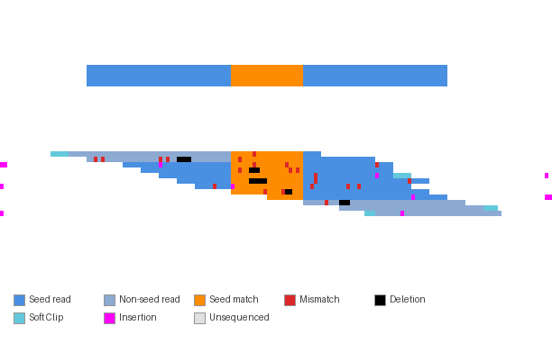
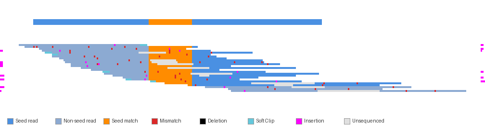
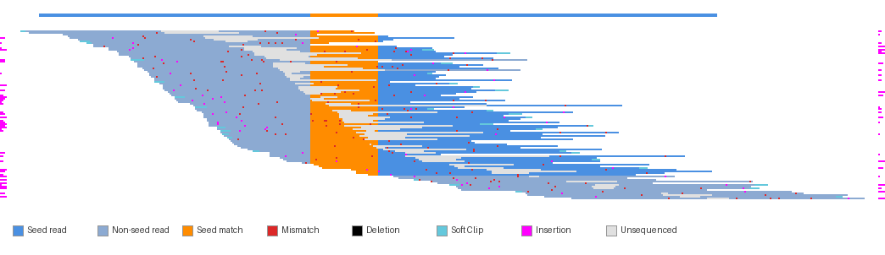

# Pileup Visualization

Visualizes how paired-end reads align to an assembled contig, highlighting a seed sequence of interest.



<details>
<summary>More examples</summary>

**25 reads:**


**100 reads:**


</details>

## Requirements

```bash
uv pip install -r requirements.txt  # Installs Pillow for image rendering
```

## Inputs

| Input | Description |
|-------|-------------|
| `fwd_fastq` | Forward reads (R1) FASTQ file |
| `rev_fastq` | Reverse reads (R2) FASTQ file |
| `contigs_fasta` | Assembled contigs FASTA file |
| `contig_name` | Name of the contig to visualize |
| `seed_sequence` | DNA sequence to highlight (e.g., the assembly seed) |
| `output` | Output PNG path |

## Usage

```bash
python pileup_visualization.py \
    reads_R1.fastq \
    reads_R2.fastq \
    contigs.fasta \
    "contig_1" \
    "ATCGATCGATCG" \
    output.png
```

## Optional Arguments

| Argument | Default | Description |
|----------|---------|-------------|
| `--scale-x` | 2 | Horizontal pixel scale factor |
| `--scale-y` | 2 | Vertical pixel scale factor |
| `--padding` | 10 | Padding around image elements (pixels) |
| `--contig-height` | 10 | Height of contig ribbon (pixels) |
| `--threads` | 4 | Threads for bowtie2 alignment |

## Output

A PNG image showing:
- **Top ribbon**: The contig sequence (blue = non-seed, orange = seed region)
- **Stacked rows**: Each row is one read pair, sorted by alignment position
- **Left/right sidebars**: Magenta markers indicating insertions

### Color Legend

| Color | Meaning |
|-------|---------|
| Blue | Matching bases (seed-containing read) |
| Muted blue | Matching bases (non-seed read) |
| Orange | Matching bases within the seed region |
| Red | Mismatched bases |
| Black | Deletions |
| Cyan | Soft-clipped bases |
| Magenta | Insertion markers |
| Light grey | Unsequenced insert (gap between mates) |

## Python API

(probably not necessary, but just in case we want to do something else with the image besides save it with Pillow)
```python
from pileup_visualization import create_pileup_visualization

image = create_pileup_visualization(
    fwd_fastq="reads_R1.fastq",
    rev_fastq="reads_R2.fastq",
    contigs_fasta="contigs.fasta",
    contig_name="contig_1",
    seed_sequence="ATCGATCGATCG",
    output_path="output.png",  # Optional: saves to file
    scale=(2, 2),
    padding=10,
    contig_height=10,
    threads=4
)
# Returns: numpy array of shape (height, width, 4) with RGBA values
```

